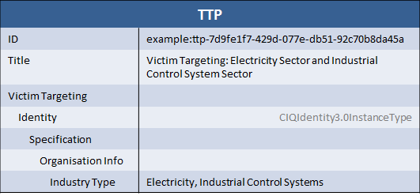

A key usage of the [TTP](/data-model/{{site.current_version}}/ttp/TTPType) component is to characterize the types of victims that a particular threat targets, known as victim targeting. This idiom describes how to use the victim targeting structures in STIX to characterize a threat that targets particular industry sectors, such as the Energy Sector and the Banking and Finance Sector.

TTP Victim Targeting, including by industry sector, is commonly used within a larger STIX document by relating it to a threat actor or a campaign via a Related TTP. For example, the [Campaign Victim Targeting](../../campaign/victim-targeting) idiom describes linking a campaign to the victims that campaign targets: when combined with this idiom, you could describe a campaign that targets victims by industry sector.

## Scenario

In this scenario, the STIX document describes a very simple victim targeting structure that denotes that the targeting of organizations in the energy sector and in the banking and finance sector.

## Data model

The portion of the TTP data model that is used to represent victim targeting is [VictimTargetingType](/data-model/{{site.current_version}}/ttp/VictimTargetingType). That type contains a field called `Identity` that is used to express characterizing facts about the identity of targeted victims, including things like relevant industry sectors.

The `Identity` field is an extension point represented by [IdentityType](/data-model/{{site.current_version}}/stixCommon/IdentityType). The default extension provided by STIX for use in expressing identity is the [CIQIdentity3.0InstanceType](/data-model/{{site.current_version}}/stix-ciqidentity/CIQIdentity3.0InstanceType), which leverages the external [CIQ](https://www.oasis-open.org/committees/tc_home.php?wg_abbrev=ciq) (Customer Information Quality) standard published by OASIS. Though it's possible to use a different extension, in most cases producers will be using CIQ.

Within CIQ, the specific field used is `@IndustryType` within `OrganisationInfo`. That field is an XML attribute and, therefore, the suggested practice is to use a comma separated list when multiple values are needed.

## XML


<stix:TTPs>
    <stix:TTP timestamp="2014-02-20T09:00:00.000000Z" id="example:ttp-030d3edf-da7c-4d1f-a0b9-6c38a8af73db" xsi:type="ttp:TTPType">
        <ttp:Title>Victim Targeting: Electricity Sector and Industrial Control System Sector</ttp:Title>
        <ttp:Victim_Targeting>
            <ttp:Identity id="example:ciqidentity3.0instance-f8cd0af8-6534-496e-bf53-f6a9aa11e5ce" xsi:type="stixCIQIdentity:CIQIdentity3.0InstanceType">
                <stixCIQIdentity:Specification>
                    <xpil:OrganisationInfo xpil:IndustryType="Electricity Sector, Industrial Control System Sector"/>
                </stixCIQIdentity:Specification>
            </ttp:Identity>
        </ttp:Victim_Targeting>
    </stix:TTP>
</stix:TTPs>


[Full XML](victim-targeting-sector.xml)

## Python


from stix.ttp import TTP, Behavior, VictimTargeting
from stix.extensions.identity.ciq_identity_3_0 import (CIQIdentity3_0Instance, STIXCIQIdentity3_0, OrganisationInfo)

ciq_identity = CIQIdentity3_0Instance()
identity_spec = STIXCIQIdentity3_0()
identity_spec.organisation_info = OrganisationInfo(industry_type="Electricity, Industrial Control Systems")
ciq_identity.specification = identity_spec

ttp = TTP(title="Victim Targeting: Electricity Sector and Industrial Control System Sector")
ttp.victim_targeting = VictimTargeting()
ttp.victim_targeting.identity = ciq_identity

print ttp.to_xml()


[Full Python](victim-targeting-sector.py)

## Further Reading

* [TTP](/data-model/{{site.current_version}}/ttp/TTPType)
* [Victim Targeting](/data-model/{{site.current_version}}/ttp/VictimTargetingType)
* [OASIS CIQ](https://www.oasis-open.org/committees/tc_home.php?wg_abbrev=ciq)
